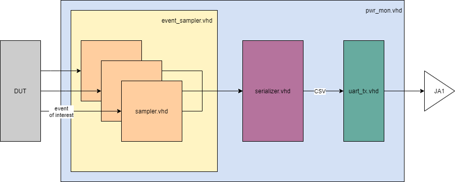

# Introduction

This repo consists of a Vivado project which enables power monitoring of a VHDL module during execution.
The hardware in use is the ZedBoard.

## Developers

* Daniel Aspodinger
* Patrick Himler
* Paul Unfried
* Lukas Vogl

# Design Under Test

For the proof-of-concept a AES encryption/decryption module is used. (Source: https://github.com/jasonrtsang/zedboard_aes)

# Power Monitoring

Power monitoring is done by extracting indicative signals from the Design Under Test (DUT).
These signals are connected to the "pwr-mon" module which counts the falling and rising edges of those signals.

The measured values are flushed to UART in a periodic manner. As a output format CSV is used.

CSV-data is then picked up by the Excel-tool which provides a diagram of the measured values.

## Block diagram

# How To

To compile the project please check the AES project and follow the README there.

In order to get the design on the board a boot.bin file is needed to be placed on a SD card -> See AES project.
Unfortunately we did not manage to get the boot.bin out of Vitis (which replaced Xilinx-SDK in a newer version).

The workaround we found:

* Copy boot.bin from the AES project on SD card and insert in zedboard
* Turn on zedboard and connect to PC
* Zedboard should boot the AES application
* Generate bitstream in Vivado (this might take several minutes)
* Open hardware manager in Vivado and program bitstream to FPGA
* AES application should boot but with the new bitstream in the FPGA

Uart output is mapped to JA1.
